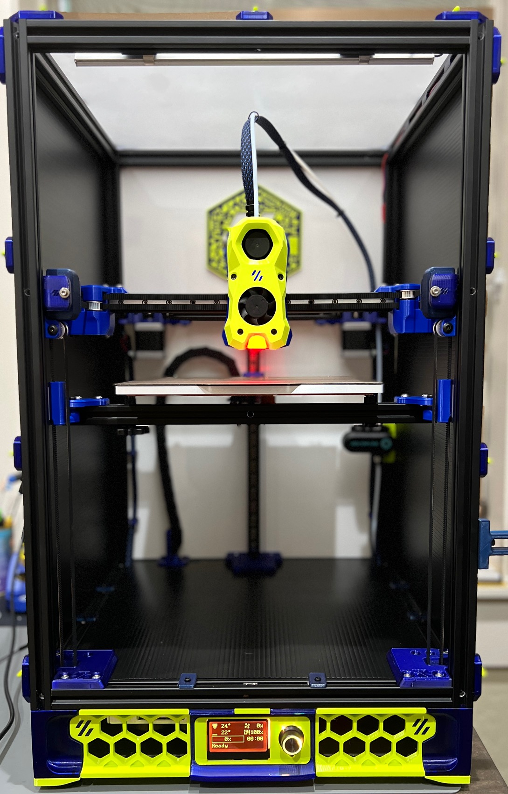
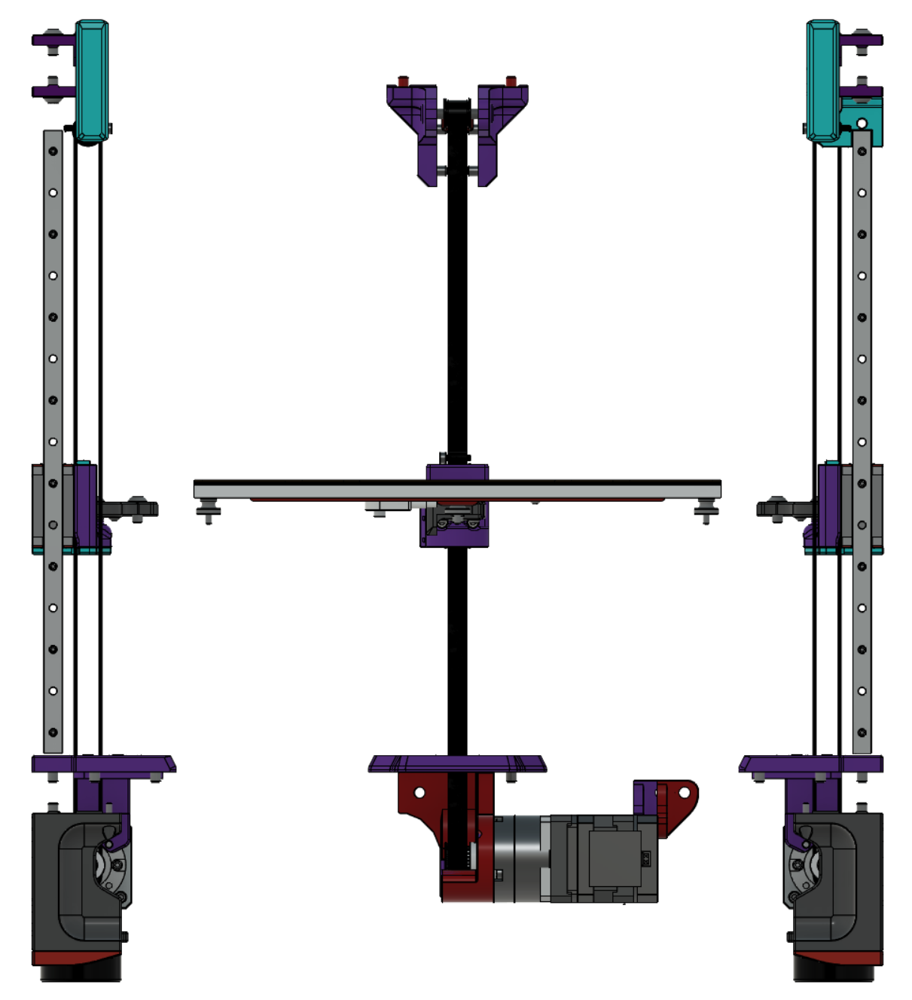
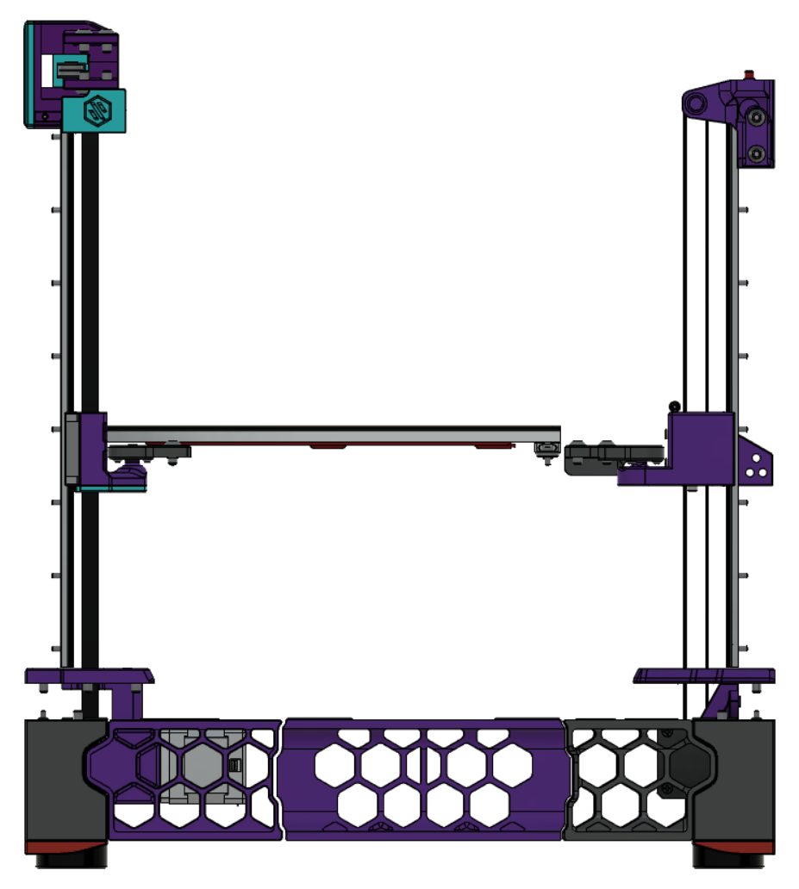
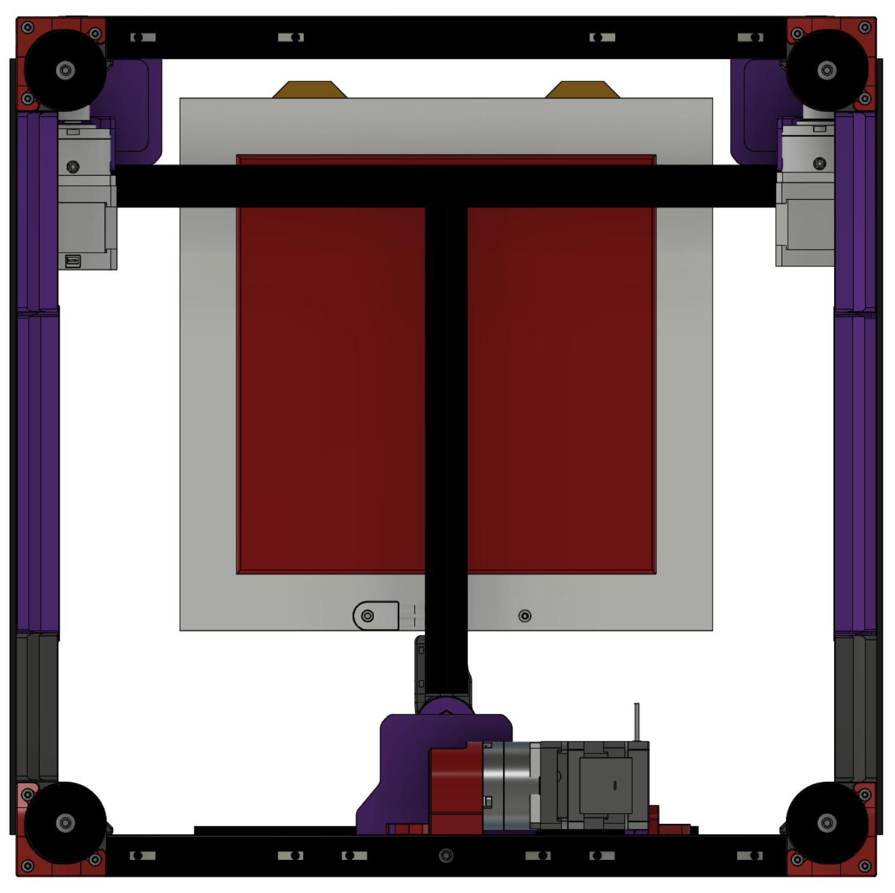

<br/>
<p align="center">
  <h3 align="center">Voron Trident Belted Z</h3>

  <p align="center">
    Belt all the things.
    <br/>
    <br/>
  </p>
</p>


## About The Project



This `mod` is the combination of multiple ideas for belted system for the Trident Z motion. Most of the inspiration came from X0, which uses NEMA 17 gearboxes. The main goal was to use 9mm belts for Z motion while keeping most of the original Trident skirts and not relocating Z steppers to the top of the printer. We give credit to `bythorsthunder` for his [Orion belted mod](https://github.com/bythorsthunder/Orion-Tri-Belt), which has also been proven efficient and easy to assemble (the same applies to the [belted z motion](https://github.com/MathematicalPotato/Voron_Mods/tree/main/VT_Belted_Z) mod introduced by `MathematicalPotato`).

## General Info

The design offers two different options for the Z idlers:

MathmaticalPotato Idlers: 
 - Uses existing XY front idlers
 - Limited to ONLY 9mm wide pulleys (12mm overall width)
<p align="left">
  
</p>


DoubleT XYZ Idlers:
 - Modified version of the Ramalama2 idler design
 - Z idler pully integrated into XY idler
 - More flexibility in Z pulley width
<p align="left">
  
</p>

Refer to the CAD drawing for detail on both Idlers.
BOM contains sections for both.

## July 2nd Update:
 - Revised rear motor mount and idler.  Orientation of the motor turned 90 degrees. New idler replaces the rear bracing from Z extrusion to A/B drive extrusion
 - New front idler option added. Integrated the Z idler pulley into DoubleT's modified Rama idlers.
 - Cleaned up the CAD

## Bill Of Materials

Required parts:
- 3 NEMA 17 Economy planetary steppers
	- [Ali Express](https://www.aliexpress.us/item/3256804434852612.html)
	- [Amazon](https://www.amazon.com/STEPPERONLINE-Planetary-Gearbox-Stepper-Printer/dp/B00WATUFIG)
- 9mm GT2 belts
- 3 9mm 20T GT2 drive pulleys, 8mm ID
- 3 9mm 20T toothed idlers, 5mm ID - Gates/Runice recommended. (Overall width of less than 14mm, Flange diameter less than 16mm)
- 9 M3x12 Button head screws (mounting gearmotors)
- 8 M3x30 Socket head screws (Front Motor Bracing, Rear Z carriage mounting)
- 2 M3x35 screws (Front Z belt tensioners)
- 1 M3x40 screw (Rear Z belt tensioner)
- 7 M3 heatset inserts (Front motor bracing, Z belt tensioners)
- 2 M5x35 screws and nuts (front idlers)
- 1 M5x25 screw and nut (rear idler)
- 1 5mmx30mm dowel (Rear Z Idler Shaft)
- 20 M5x10 screws and hammerhead nuts for mounting motor mounts and idlers
- 1 M3 x ? length screw - Length determined by motor chosen. Remove one screw from the nema17 motor housing and replace with longer screw for the rear motor stabilizer.

<p align="left">
  
</p>

Mathematical Potato Idlers:
- 2 M4x20 Socket head screws and hammerhead nuts
- 2 M5x40 Button head screws
- 2 M5 nuts
- 2 M5x15 Button Head Screws

DoubleT XYZ Idlers
 - Reuses existing fasteners for securing idler to Y extrusion
4 - M3 heatset inserts
4 - M3x30 Button head screws
2 - M3x12 Socket head screws
2 - M3x20 Socket head screws and hammerhead nuts
2 - 5mm x 25mm dowel
2 - 5mm x 20mm dowel
4 - 6mm x 3mm magnets


## Authors

* **genevamotion** - ** - [genevamotion](https://github.com/tdlane1) - *CAD design/ Modeling / Testing*
* **thiagolocatelli** - ** - [thiagolocatelli](https://github.com/thiagolocatelli) - *CAD design / Modeling / Project Management*

## Acknowledgements

* [MathematicalPotato](https://github.com/MathematicalPotato)
* [bythorsthunder](https://github.com/bythorsthunder)
* [Annex Engineering](https://github.com/Annex-Engineering)
* [Voron Design](https://github.com/VoronDesign)
* [Ramalama](https://github.com/Ramalama2)


## Images

<p align="center">
  
</p>

<p align="center">
  
</p>

<p align="center">
  
</p>


<p align="center">
  
</p>


<p align="center">
  
</p>


## Sample config (Manta M8P) - Economy Gearbox 

```
#####################################################################
#   Z Stepper Settings
#####################################################################

##  Z0 Stepper - Front Left
##  Connected to MOTOR_3
##  Endstop connected to M3-STOP
[stepper_z]
step_pin: PD7
dir_pin: !PD6
enable_pin: !PF10
# Rotation Distance for TR8x8 = 8, TR8x4 = 4, TR8x2 = 2
rotation_distance: 7.75    
microsteps: 32
endstop_pin: PF5
##  Z-position of nozzle (in mm) to z-endstop trigger point relative to print surface (Z0)
##  (+) value = endstop above Z0, (-) value = endstop below
##  Increasing position_endstop brings nozzle closer to the bed
##  After you run Z_ENDSTOP_CALIBRATE, position_endstop will be stored at the very end of your config
#position_endstop: -0.5
## All builds use same Max Z
position_max: 250
position_min: -2.5
homing_speed: 8.0 # Leadscrews are slower than 2.4, 10 is a recommended max.
second_homing_speed: 3
homing_retract_dist: 3

##  Make sure to update below for your relevant driver (2208 or 2209)
[tmc2209 stepper_z]
uart_pin: PF9
interpolate: False
run_current: 1.0
sense_resistor: 0.110
stealthchop_threshold: 0

```