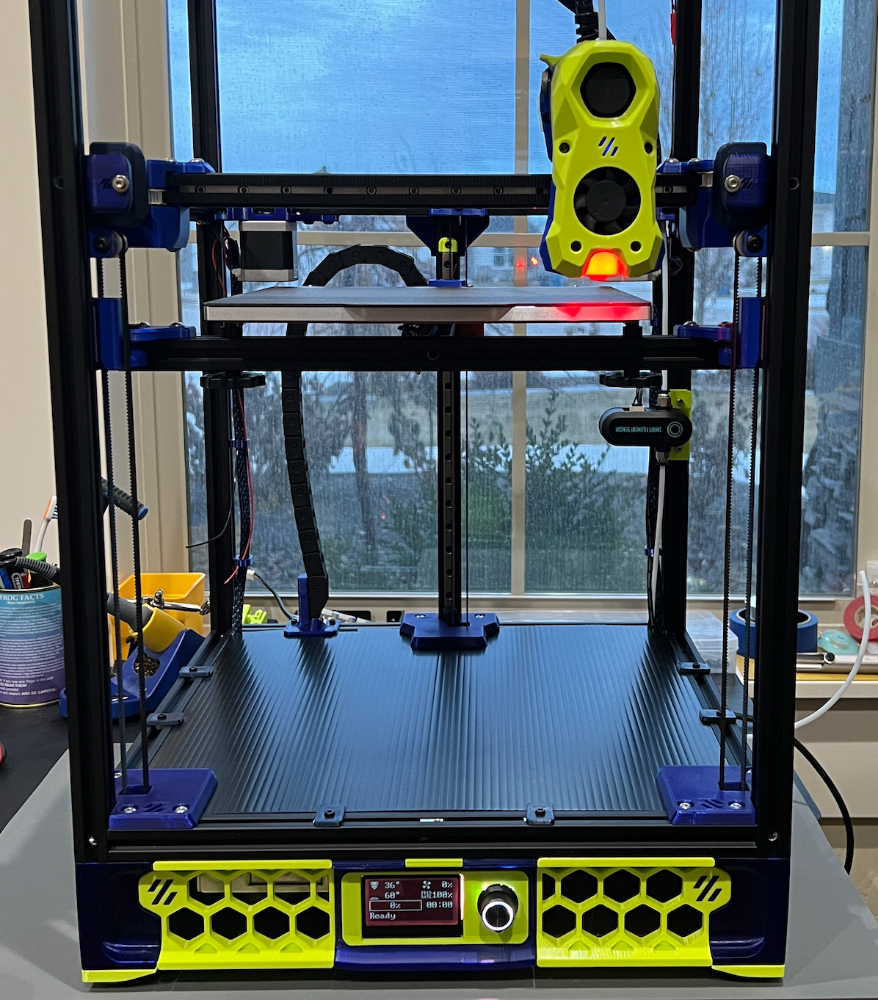
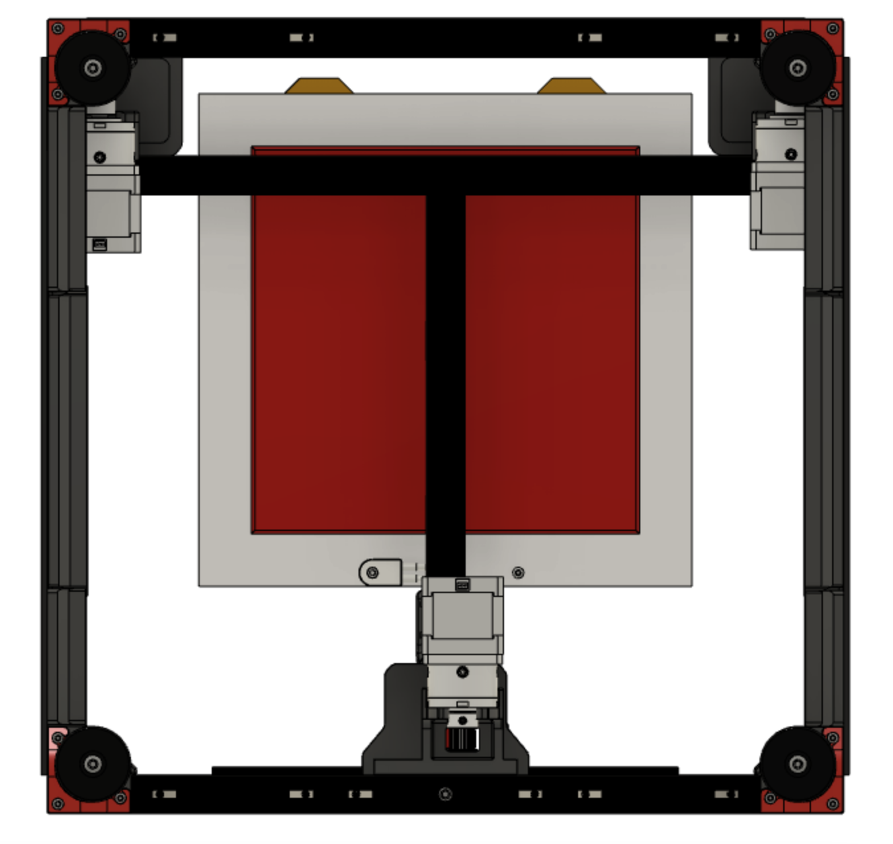
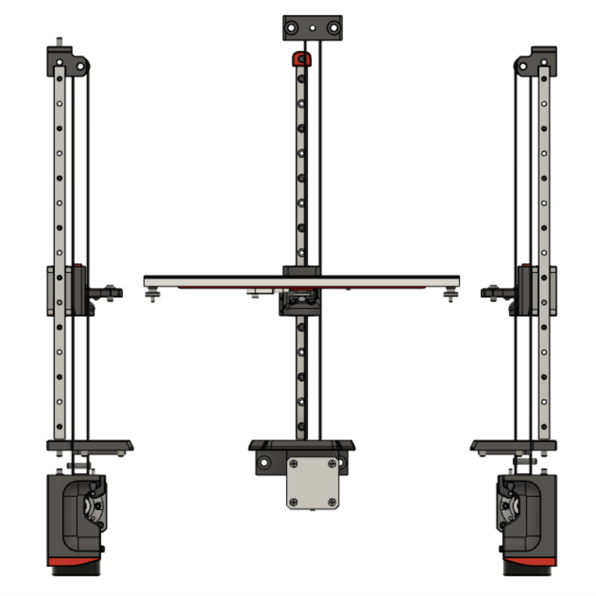
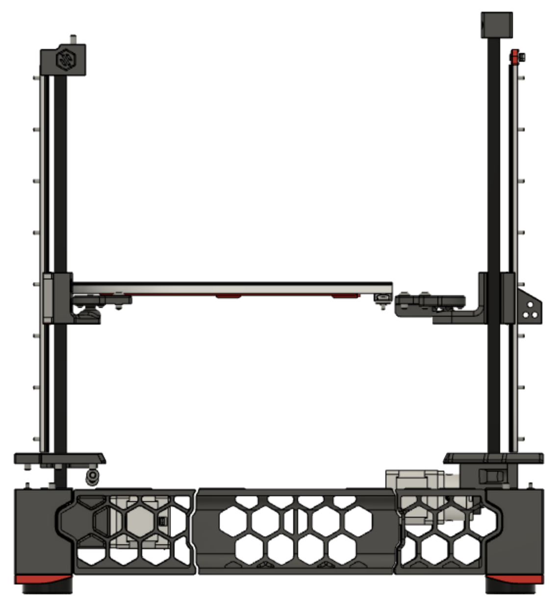
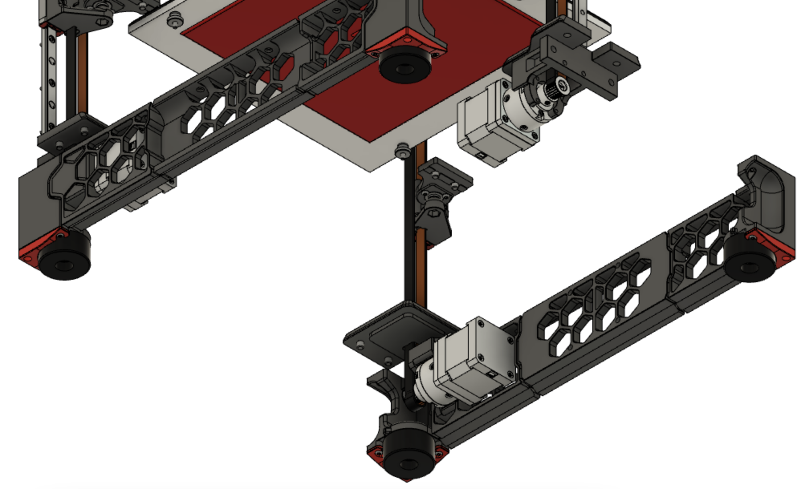

# Voron Trident - Belted Z motion

This `mod` is the combination of multiple ideas for belted system for the Trident Z motion. Most of the inspitarion came from X0, which uses Nema 17 gearboxes. The main goal was to use 9mm belts for Z motion while keeping most of the original Trident skirts and not relocating Z steppers to the top of the printer.

Created/Elaborated/Modified by `DoubleT` and `Genevamotion`

Disclaimer: This is *not* a official Voron mod/design.

## BOM

	- 3 Nema 17 with gearbox
	- [Ali Express](https://www.aliexpress.us/item/3256804434852612.html)
	- [Amazon](https://www.amazon.com/STEPPERONLINE-Planetary-Gearbox-Stepper-Printer/dp/B00WATUFIG)
	- 9mm GT2 belts
	- 3 9mm pulley, 8mm OD
	- 3 9mm idlers, 5mm ID

## Images

<p align="center">
  
</p>

<p align="center">
  
</p>

<p align="center">
  
</p>


<p align="center">
  
</p>


<p align="center">
  
</p>


## Sample config

```


```